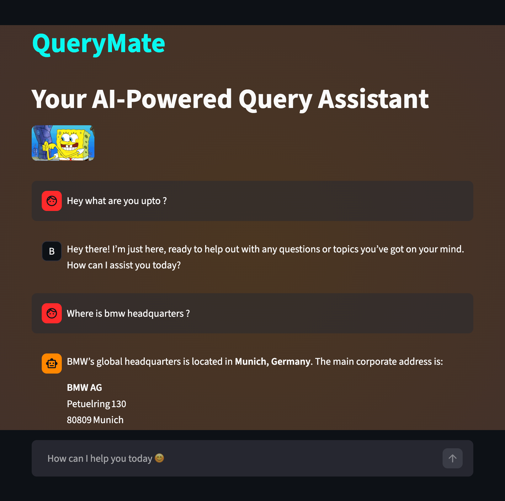

# QueryMate: AI-Powered Real-Time Chatbot

QueryMate is a **Streamlit-based AI chatbot** that provides real-time responses to queries about general questions using the Hugging Face model `openai/gpt-oss-120b:groq`.  

---

## **Features**

- Streamlit-powered web interface
- **Live streaming** AI responses in the chat bubble
- Preserved **session based chat history**
- colorful **animated title**, colored **background and chat bubble**.

---

## **Requirements**

- macOS (M1/M2/M4 recommended)  
- Miniconda (will be installed automatically if missing)  
- Python 3.11 (installed via Conda)  
- Internet connection for Hugging Face Inference API  

---

## **Setup & Installation**

All setup can be done using the **`setup_and_run.sh`** script.

### **Step 1: Clone the repository**

- git clone <your-repo-url>
- cd <your-repo-folder>

### **Step 2: Add your API token to your ~/.zshrc:**

- echo 'export HF_API_TOKEN="your_huggingface_api_token"' >> ~/.zshrc
- source ~/.zshrc

### **Step 3: Run the script**

- chmod +x setup_and_run.sh
- ./setup_and_run.sh

---

### **This script will:**

1) Install Miniconda (if not installed)
2) Create a Conda environment called myvenv with Python 3.11
3) Install required Python packages:
- streamlit
- huggingface-hub
- transformers
- sentence-transformers
- torch
- faiss-cpu
- python-dotenv
4) Activate the environment and launch the chatbot app (bot.py) via Streamlit

---

## **Usage**

- After running the script, Streamlit will provide a local URL, usually: http://localhost:8501

---

## **Project structure**

.
├── app.py                 # Main Streamlit chatbot application
├── setup_and_run.sh       # One-shot setup and run script
├── README.md              # Project documentation
└── .gitignore             # Recommended to ignore sensitive files

---

## **To run the app again after the first setup:**

conda activate myvenv
streamlit run app.py

